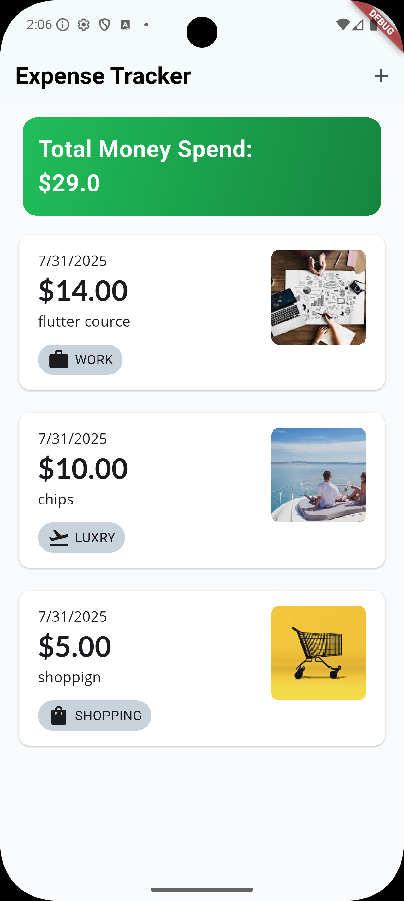
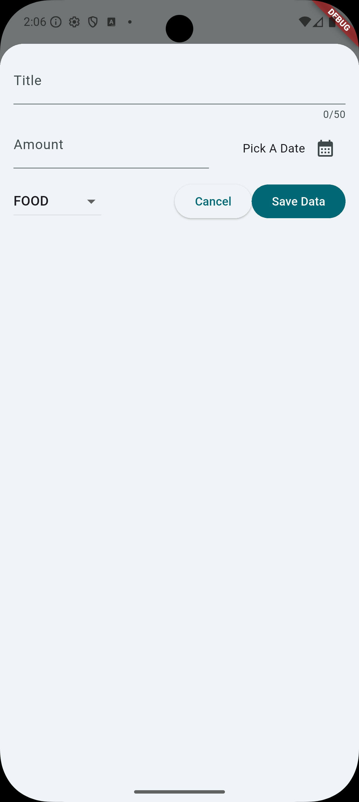
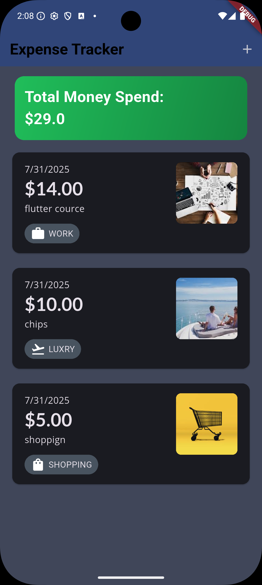
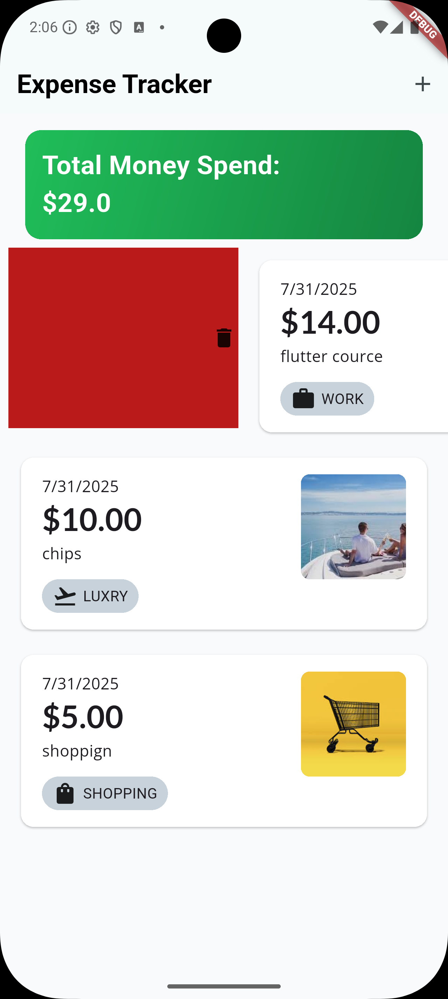

# Expense Tracker 💰

[](https://flutter.dev/)
[](https://dart.dev/)
[](LICENSE)

A simple and elegant Flutter application to track daily expenses and monitor your total spending. Built with a clean, modern UI that supports both light and dark themes for optimal user experience.

## 📱 Screenshots

| Main Screen (Light) | Add Expense | Main Screen (Dark) | Swipe to Delete |
|---------------------|-------------|-------------------|-----------------|
|  |  |  |  |

## ✨ Features

- 💸 **Expense Tracking**: Add and manage daily expenses with ease
- 📊 **Total Spending**: View your total money spent at a glance
- 🏷️ **Category System**: Organize expenses by categories (WORK, LUXURY, SHOPPING, FOOD, etc.)
- 🖼️ **Visual Categories**: Each category comes with beautiful icons and color coding
- 📅 **Date Tracking**: Automatic date assignment for each expense
- 🗑️ **Swipe to Delete**: Intuitive swipe gesture to remove expenses
- 🌓 **Theme Support**: Beautiful light and dark theme options
- 📱 **Responsive Design**: Optimized for different screen sizes
- ✏️ **Easy Input**: Simple form with title, amount, category, and date picker
- 💫 **Smooth Animations**: Polished UI with smooth transitions and interactions

## 🚀 Getting Started

### Prerequisites

Before you begin, ensure you have the following installed:

- **Flutter SDK**: `>=3.0.0 <4.0.0`
- **Dart SDK**: `>=3.0.0 <4.0.0`
- **Android Studio** or **VS Code** with Flutter extensions
- **Git** for version control

### Installation

1. **Clone the repository**
   ```bash
   git clone https://github.com/BlueEye2077/Expense-Tracker.git
   cd Expense-Tracker
   ```

2. **Install dependencies**
   ```bash
   flutter pub get
   ```

3. **Run the app**
   ```bash
   flutter run
   ```

### Platform-specific Setup

<details>
<summary><strong>Android Setup</strong></summary>

1. Ensure you have Android SDK installed
2. Create a virtual device or connect a physical device
3. Enable Developer Options and USB Debugging on your device
4. Run `flutter doctor` to verify setup

</details>

<details>
<summary><strong>iOS Setup</strong></summary>

1. Ensure you have Xcode installed (macOS only)
2. Install CocoaPods: `sudo gem install cocoapods`
3. Run `cd ios && pod install`
4. Open iOS Simulator or connect a physical device
5. Run `flutter doctor` to verify setup

</details>

## 🏗️ Project Structure

```
lib/
├── main.dart                 # App entry point
├── models/                   # Data models
│   └── expense_model.dart    # Expense data structure
├── screens/                  # UI screens
│   ├── home_screen.dart      # Main expense list screen
│   └── add_expense_screen.dart # Add new expense screen
├── widgets/                  # Reusable widgets
│   ├── expense_card.dart     # Individual expense item widget
│   ├── total_amount_card.dart # Total spending display
│   └── category_selector.dart # Category selection widget
├── utils/                    # Utilities and helpers
│   ├── constants.dart        # App constants and categories
│   └── theme.dart           # App theming configuration
└── services/                # Business logic
    └── expense_service.dart  # Expense management logic
```

## 💡 How to Use

### Adding an Expense

1. **Tap the '+' button** on the main screen
2. **Fill in the details**:
   - **Title**: Enter a description (max 50 characters)
   - **Amount**: Enter the expense amount
   - **Category**: Select from predefined categories (FOOD, WORK, LUXURY, SHOPPING)
   - **Date**: Pick a date using the date picker
3. **Tap 'Save Data'** to add the expense

### Managing Expenses

- **View Total**: Your total spending is displayed prominently at the top
- **Browse Expenses**: Scroll through your expense list with visual category indicators
- **Delete Expenses**: Swipe left on any expense item to reveal the delete option
- **Category Icons**: Each expense shows a relevant icon and category tag

### Available Categories

- 🍔 **FOOD** - Restaurant meals, groceries, snacks
- 💼 **WORK** - Work-related expenses, courses, office supplies
- ✈️ **LUXURY** - Entertainment, leisure, luxury items
- 🛒 **SHOPPING** - General shopping, clothes, miscellaneous items

## 🎨 Design Features

- **Clean Interface**: Minimalist design focusing on usability
- **Color-Coded Categories**: Each category has distinct colors and icons
- **Card-Based Layout**: Modern card design for expense items
- **Gradient Backgrounds**: Beautiful gradient effects in dark mode
- **Responsive Cards**: Expense cards adapt to content and screen size
- **Intuitive Navigation**: Simple and clear user flow

## 📦 Key Dependencies

Based on the app functionality, likely dependencies include:

### Core Dependencies
- **flutter**: UI framework
- **cupertino_icons**: iOS-style icons
- **shared_preferences**: Local data persistence
- **intl**: Date formatting and internationalization

### Potential Additional Dependencies
- **provider** or **bloc**: State management
- **sqflite**: Local database storage
- **image_picker**: For category icons or receipt photos

For the complete list, see [pubspec.yaml](pubspec.yaml).

## 🧪 Testing

Run the test suite:

```bash
# Run all tests
flutter test

# Run tests with coverage
flutter test --coverage

# Run integration tests
flutter drive --target=test_driver/app.dart
```

## 🔧 Configuration

### Customizing Categories

To add or modify expense categories, edit the constants file:

```dart
// lib/utils/constants.dart
enum ExpenseCategory {
  food,
  work,
  luxury,
  shopping,
  // Add new categories here
}
```

### Theme Customization

The app supports both light and dark themes. Customize colors and styles in:

```dart
// lib/utils/theme.dart
ThemeData lightTheme = ThemeData(
  // Customize light theme
);

ThemeData darkTheme = ThemeData(
  // Customize dark theme
);
```

## 🚢 Deployment

### Android (Play Store)

1. **Build APK**
   ```bash
   flutter build apk --release
   ```

2. **Build App Bundle**
   ```bash
   flutter build appbundle --release
   ```

### iOS (App Store)

1. **Build for iOS**
   ```bash
   flutter build ios --release
   ```

2. **Archive in Xcode**
   - Open `ios/Runner.xcworkspace` in Xcode
   - Select "Generic iOS Device" as target
   - Product → Archive

## 🤝 Contributing

Contributions are welcome! Please feel free to submit a Pull Request. For major changes, please open an issue first to discuss what you would like to change.

### Development Workflow

1. Fork the repository
2. Create your feature branch (`git checkout -b feature/AmazingFeature`)
3. Commit your changes (`git commit -m 'Add some AmazingFeature'`)
4. Push to the branch (`git push origin feature/AmazingFeature`)
5. Open a Pull Request

### Code Style

- Follow [Dart style guide](https://dart.dev/guides/language/effective-dart/style)
- Use `flutter format` to format your code
- Run `flutter analyze` to check for issues

## 🎯 Future Enhancements

Potential features to add:

- 📊 **Charts and Analytics**: Visual spending reports and trends
- 🏦 **Multiple Accounts**: Support for different accounts/wallets
- 💱 **Currency Support**: Multi-currency expense tracking
- 📱 **Cloud Sync**: Backup and sync across devices
- 🔔 **Budget Alerts**: Spending limit notifications
- 📄 **Export Data**: Export expenses to CSV/PDF
- 🔍 **Search and Filter**: Advanced expense filtering options

## 📄 License

This project is licensed under the MIT License - see the [LICENSE](LICENSE) file for details.

## 🙏 Acknowledgments

- Flutter team for the amazing framework
- Community for Flutter plugins and packages
- Icon designers for beautiful category icons

## 📞 Support

If you have any questions or need help:

- 📧 Open an issue on GitHub
- 🐛 [Report bugs](https://github.com/BlueEye2077/Expense-Tracker/issues)
- 💡 [Request features](https://github.com/BlueEye2077/Expense-Tracker/issues)

## 🔗 Repository

- **GitHub**: [BlueEye2077/Expense-Tracker](https://github.com/BlueEye2077/Expense-Tracker)

---

**Made with ❤️ and Flutter**

*A simple solution for daily expense tracking with beautiful UI and smooth user experience.*